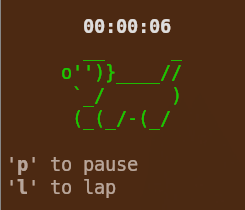

# 🐶 stopwatch.sh




| Key | Action |
| :--- | :--- |
| **p** | Pause / Resume |
| **l** | Lap (Log timestamp) |
| **Ctrl+C** | Quit |

## Usage

```bash
chmod +x ttywatch.sh
```

## Basic run
```bash
./stopwatch.sh
```

## Run with a goal
```bash
./stopwatch.sh -g "Deploy to Production"
```
